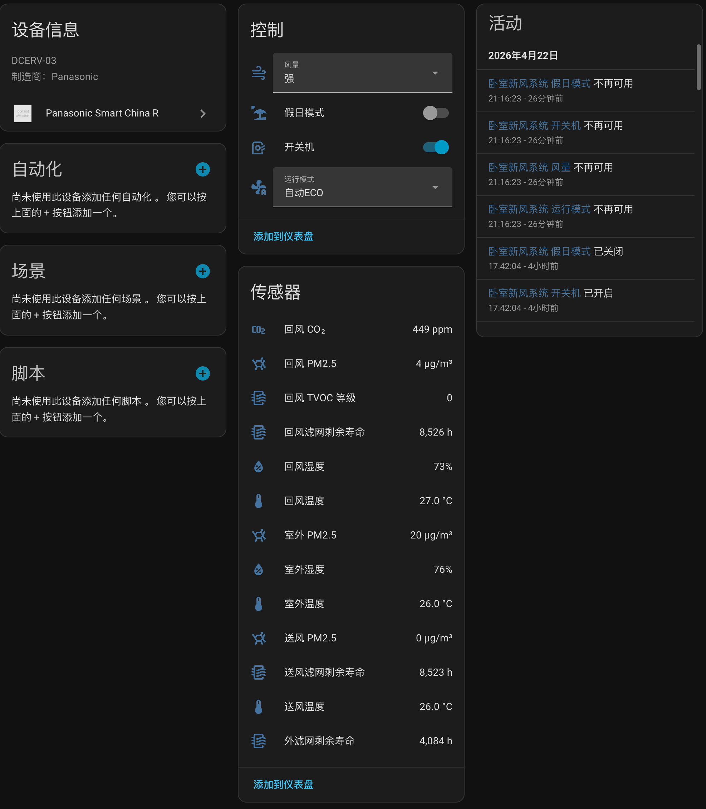
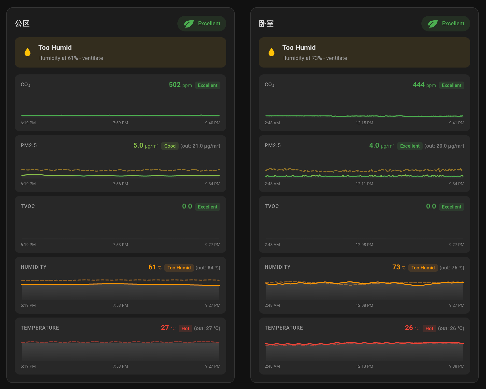

# Panasonic Smart China R

[](https://github.com/hacs/integration)
[]()

Home Assistant 自定义集成，对接**松下智能家电（中国大陆）**云端 API，支持中央空调和新风换气设备。

本项目基于 [mcdona1d/panasonic_smart_china](https://github.com/mcdona1d/panasonic_smart_china) 开发，在此基础上加入了新风设备支持，并大幅扩展了云端通信逻辑。感谢 arthurfsy 最早公开松下云端登录算法，感谢 Hassbian 论坛 omegaojian 对 MidERV 设备的抓包分析，为本项目逆向 DCERV-03 端点提供了关键线索。MidERV 与 SmallERV 机型的 payload 字段、运行模式值域和风量档位数据，参考自社区 [dkong5ssss/panasonic_smart_china_erv](https://github.com/dkong5ssss/panasonic_smart_china_erv) 项目，感谢该项目作者的实测和整理。

---

## 效果截图

　

---

## 支持设备

### 中央空调（category `0900`）✅ 完全可用

- 型号：配合 `CZ-RD501DW2` 线控器的松下家用多联/风管机
- 提供标准 `climate` 实体，支持开关机、模式切换、温度设定、风速调节

### 新风换气机（category `0800`，DCERV-03）✅ 完全可用

型号：FY-35ZJD2C 等 DCERV-03 系列

**传感器（稳定可用）：**

| 传感器 | 字段 | 说明 |
|--------|------|------|
| 室外 PM2.5 | `oaPMC` | µg/m³ |
| 送风 PM2.5 | `saPMC` | µg/m³ |
| 回风 PM2.5 | `raPMC` | µg/m³ |
| 室外湿度 | `oaHumC` | % |
| 回风湿度 | `raHumC` | % |
| 室外温度 | `oaTeC` | °C |
| 送风温度 | `saTeC` | °C |
| 回风温度 | `raTeC` | °C |
| 回风 CO₂ | `raCO2C` | ppm |
| 回风 TVOC | `raTVC` | 等级 |
| 外滤网寿命 | `oaFilExTL` | 小时 |
| 送风滤网寿命 | `saFilExTL` | 小时 |
| 回风滤网寿命 | `raFilExTL` | 小时 |

**控件（稳定可用）：**

- 开关机 (`runSta`)
- 假日模式 (`holM`)
- 运行模式选择：热交换 / 静音 / 普通换气 / 内循环 / 混风 / 自动ECO (`runM` 48–53)
- 风量选择：弱 / 强 (`airVo` 0/1)

---

## 核心特性

- **无需手动抓包**：内置双重 SHA-512 token 算法，账号密码直接登录
- **会话保活（Anti-Kickout）**：10 分钟重登冷却，避免跟手机 App 互踢 session
- **静默重登**：SSID 过期时自动用存储的凭证续期，无需手动 re-auth
- **多设备支持**：按 deviceId 区分，可同时添加多台设备

---

## 安装

### HACS（推荐）

1. HACS → 集成 → 右上角菜单 → Custom repositories
2. 填入 `https://github.com/rudyll/panasonic_smart_china_r`，类别选 Integration
3. 搜索 `Panasonic Smart China R`，下载
4. 重启 Home Assistant

### 手动安装

1. 下载本项目，将 `custom_components/panasonic_smart_china_r` 复制到 HA 配置目录的 `custom_components/` 下
2. 确认路径：`/config/custom_components/panasonic_smart_china_r/__init__.py`
3. 重启 Home Assistant

---

## 配置

1. 配置 → 设备与服务 → 添加集成 → 搜索 **Panasonic Smart China R**
2. 输入松下智家 App 的手机号和密码
3. 选择设备（空调选控制器型号；新风机直接确认）

> 松下云端为单点登录。HA 接管 session 后，手机 App 再次登录会把 HA 踢下线（反之亦然）。内置冷却机制可减少抢占频率，但无法完全避免。若需长期稳定共存，建议用第二个松下账号并通过 App 内设备分享授权。

---

## Token 算法

松下 DCERV-03 设备 token 为双层 SHA-512：

```python
parts = device_id.split("_")   # 格式：MAC_CATEGORY_SUFFIX
mac = parts[0].upper()
category = parts[1].upper()
suffix = parts[2]               # 注意：suffix 保持原始大小写，不能 upper()
inner = sha512(f"{mac[6:]}_{category}_{mac[:6]}")
token = sha512(f"{inner}_{suffix}")
```

**注意**：suffix 全转大写会导致 token 校验失败，这与 App JS 源码的 `toUpperCase` 不一致，是 DCERV-03 型号的特殊行为。

---

## 兼容性

- Home Assistant 2024.1+
- Python 3.11+
- 仅适用于中国大陆地区"松下智能家电" App（蓝色图标），不支持国际版 Comfort Cloud

---

## 其他设备型号

本插件目前仅实测 DCERV-03 和 0900 空调。如果你的松下设备型号不同，可参考 [Wiki：如何适配新设备](https://github.com/rudyll/panasonic_smart_china_r/wiki/适配新设备型号) 自行逆向并提交 PR。

---

## 免责声明

本项目为社区开源作品，非松下官方出品。通过模拟 App API 请求实现功能，请合理使用。因使用本项目导致的设备异常或账号问题，开发者不承担责任。

---
